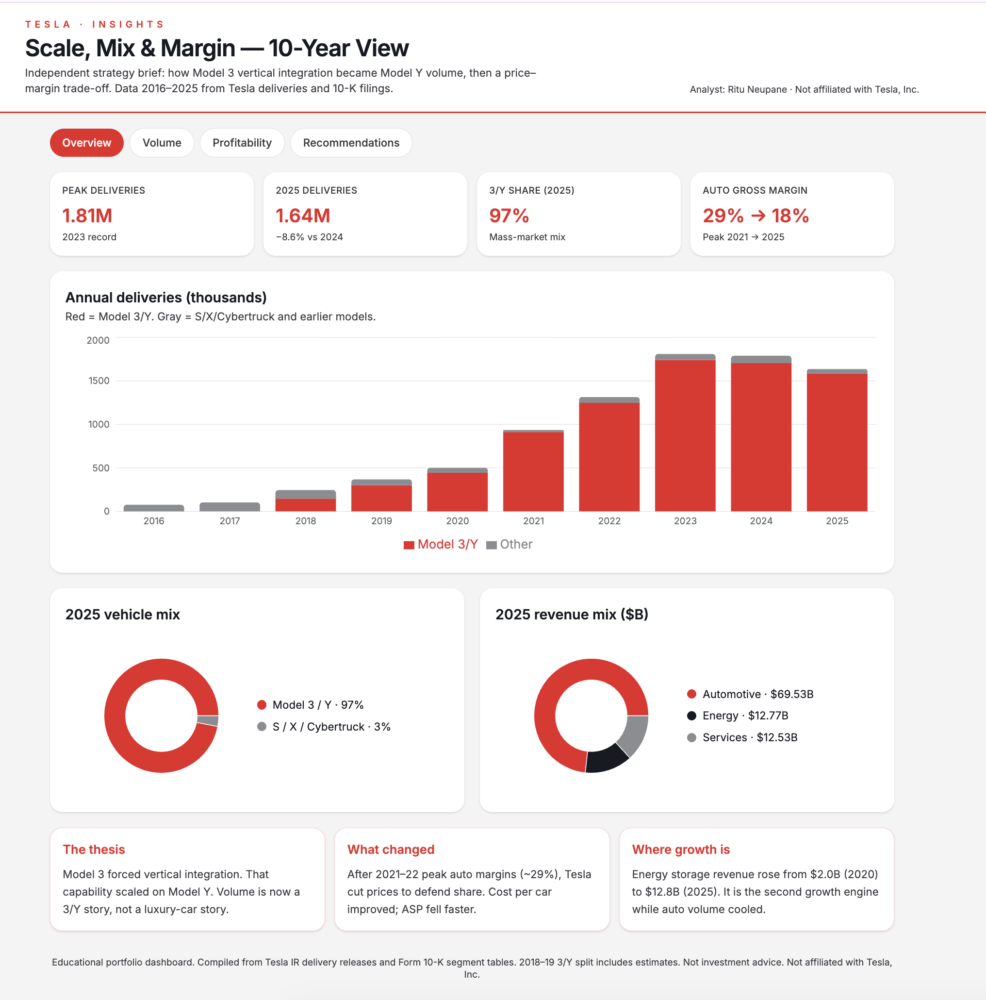
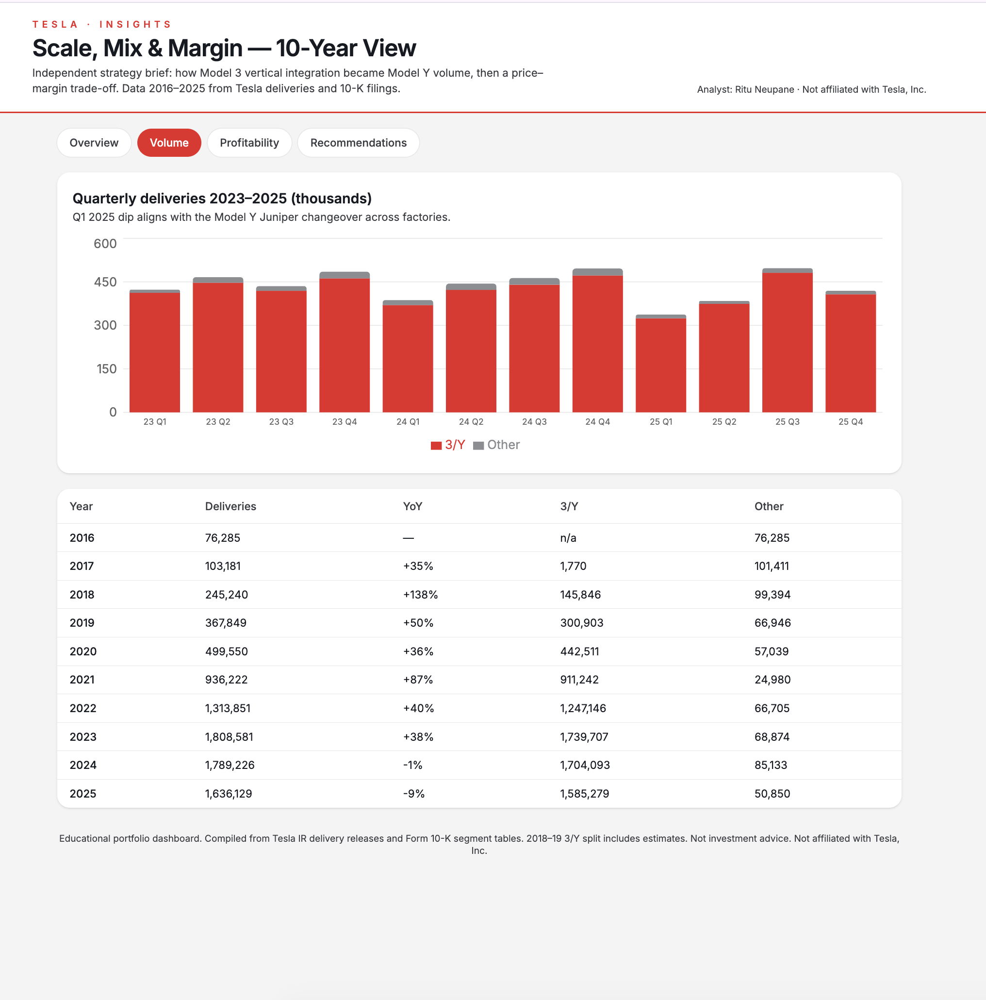
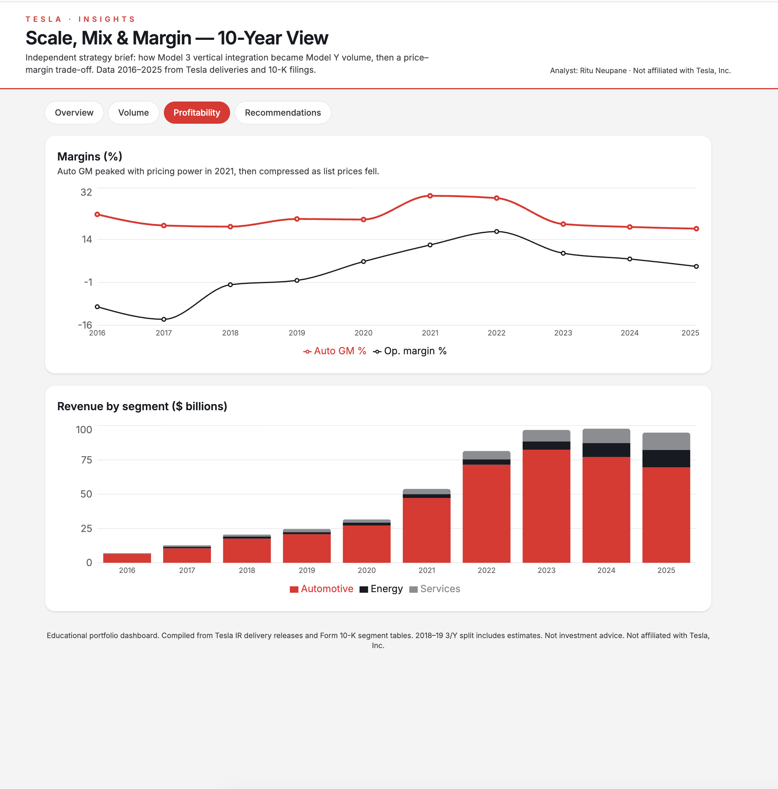

# Tesla 10-year operating dashboard

I pulled Tesla's public delivery reports and 10-K numbers from 2016 to 2025 and put them in one place. I wanted to see whether the Model 3 / Model Y ramp actually shows up in mix and margin — not just in headlines.

**Ritu Neupane** · New York

This is my own compilation. Not Tesla. Not a stock pick.

## What I looked at

1. Did scale work after Model 3?
2. What does Tesla actually sell (3/Y vs everything else)?
3. What happened to margin after the price cuts?

## What I found

- Deliveries went from about **76,000** in 2016 to a peak of **1.81 million** in 2023, then **1.64 million** in 2025.
- In 2025, **about 97%** of deliveries were Model 3 and Model Y.
- Automotive gross margin peaked near **29% in 2021** and was around **18% in 2025**.
- Energy revenue grew from about **$2 billion (2020)** to **$12.8 billion (2025)** while auto slowed.

The 2018–2019 3/Y split is estimated. Tesla started reporting 3/Y as one bucket in 2020.

## Dashboard

Deliveries are in thousands of vehicles. Revenue is in $ billions. Margins are in %.

**Overview**



**Volume**



**Profitability**



## Files

```
data/tesla_annual.csv      10-year annual series
data/tesla_quarterly.csv   quarterly deliveries, 2023–2025
data/SOURCES.md            where the numbers came from
analysis/notes.md          my takeaways
screenshots/               overview, volume, profitability
```

Open the CSVs in Excel if you want to check the math.
